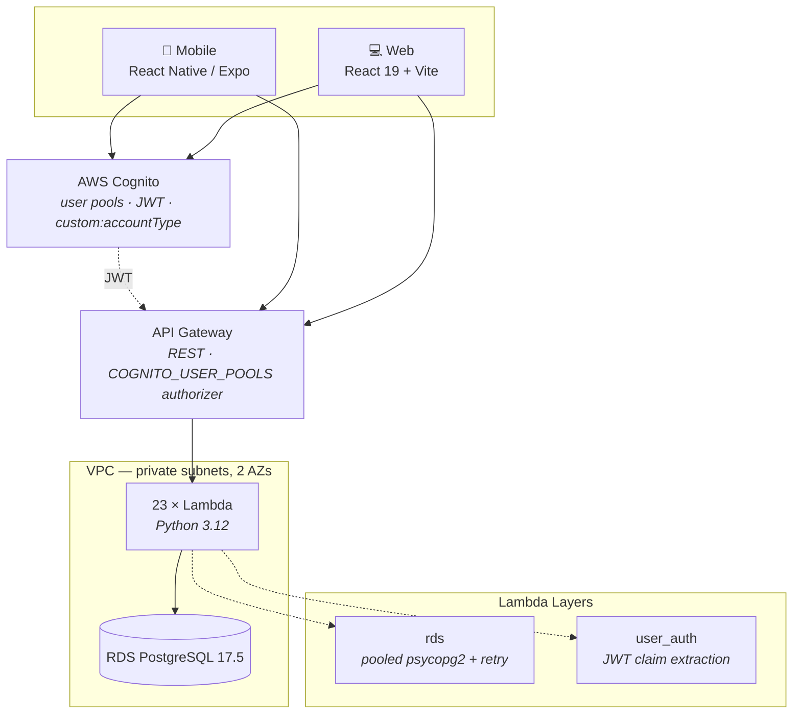

# TrackMe

**A full-stack training platform that replaces the group-chat-and-spreadsheet workflow most track & field programs run on.** Coaches assign work and see every athlete's results in one place; athletes log times, rest, and notes from their phone in seconds.

Built solo. Mobile app, web app, serverless API, database, and cloud infrastructure.

<p align="left">
  
  
  
  
  
  
  
</p>

---

## About TrackMe

Track & field coaches carry an unusual amount of data in their heads. A single practice might produce sixty athletes × eight reps × a split time, a rest interval, and a subjective note about how the athlete looked. In most programs that data lives in a paper notebook, a group chat, and a spreadsheet that nobody updates — so the information that should drive next week's training gets lost by Thursday.

TrackMe consolidates that loop. Athletes log reps as they happen from their phone. Coaches see every connected athlete's inputs on a shared timeline, browse any past date, and get trend analytics — work-to-rest ratio and average velocity over the last 30 training days — computed server-side from the raw inputs rather than hand-tallied.

The design constraint that shaped most of the architecture: **entry has to be faster than writing it down.** An athlete between reps will not fight a form. That pushed the input model toward a small set of typed inputs (time/distance, rest, note) that append with a single tap, a "mass input" path for coaches recording a whole group at once, and an API where the common read is a single round trip.

The second constraint was **cost**. This is a tool for high school and club programs, so it had to run for close to nothing when idle. Everything is serverless and scales to zero — the only always-on cost is a `db.t3.micro` Postgres instance.

---

## Highlights

- **Three deployable surfaces from one codebase family** — a React Native (Expo) mobile app, a React 19 + Vite web client, and a Python serverless backend, sharing a common TypeScript domain model across both frontends.
- **23 AWS Lambda functions** behind a Cognito-authorized API Gateway, all provisioned from Terraform with a `for_each` loop rather than 23 copy-pasted resource blocks.
- **Analytics computed in SQL, not on the client** — work:rest ratio and average velocity aggregate across a 30-day window in a single query, so the mobile app renders a D3 chart from a payload of a few hundred bytes.
- **A mutual-consent social graph** — coach↔athlete links are two one-way rows; a relationship is "real" only when both directions exist. This makes invites, accepts, and blocks the same primitive, and reduces to one self-join at read time.
- **41 integration tests** running against a real Postgres in Docker — not mocks. Every test exercises the actual Lambda handler against the actual schema.
- **Zero-config local development** — `docker compose up` plus SAM local gives you the whole API on `localhost:3000` with a seeded database.

---

## Architecture



**Request path:** the client authenticates against Cognito and attaches the JWT. API Gateway validates it before invoking anything, so no Lambda ever sees an unauthenticated request. The `user_auth` layer reads `sub`, `cognito:username`, and the custom `accountType` claim straight off the pre-validated authorizer context — meaning **authorization is a claim read, not a database lookup**, and it costs nothing on the hot path.

Lambdas run inside private subnets across two availability zones with no route to the internet; the database has no public endpoint and is reachable only through a bastion host for migrations.

---

## Tech Stack

| Layer | Choices |
|---|---|
| **Mobile** | React Native 0.81, Expo 54, React Navigation 7, NativeWind (Tailwind for RN), D3, Expo SecureStore |
| **Web** | React 19, Vite 7, TypeScript 5.9, Tailwind 4, React Router 7, Preact Signals |
| **Backend** | Python 3.12, AWS Lambda, API Gateway (REST), psycopg2, Lambda Layers |
| **Data** | PostgreSQL 17.5 on RDS, SQL views for polymorphic reads |
| **Auth** | AWS Cognito user pools, JWT with custom claims, AWS Amplify on both clients |
| **Infra** | Terraform (VPC, subnets, RDS, IAM, 23 Lambdas, API Gateway, bastion), AWS SAM for local emulation |
| **Testing** | pytest, Docker Compose Postgres, 41 integration tests |

---

## Repository Structure

```
TrackMe/
├── Mobile/        React Native (Expo) app — primary client
│   ├── pages/         screens: inputs, history, relations, profile, auth
│   ├── common/        shared components, hooks, typed domain models
│   └── services/      typed API client, one module per API domain
├── web/           React + Vite web client
│   └── src/           mirrors Mobile's structure and domain types
├── Server/        Python serverless backend
│   ├── lambdas/       23 handlers grouped by domain
│   ├── layers/        rds (connection pooling) + user_auth (JWT claims)
│   ├── test/          41 pytest integration tests
│   ├── setup.sql      schema
│   └── template.yaml  AWS SAM — local emulation only
└── Terraform/     production infrastructure as code
```

---

## API Surface

23 endpoints across six domains. Every route requires a valid Cognito JWT.

| Domain | Endpoints |
|---|---|
| `/athletes` | `input_times`, `remove_inputs`, `view_workout_inputs` |
| `/general` | `create_user`, `get_user`, `update_user_profile`, `mass_input`, `get_mutual_inputs`, `get_context_urls` |
| `/relations` | `add_relation`, `remove_user_relation`, `search_user_relation`, `get_relation_invites`, `get_relation_invites_count`, `get_mutual_user_relations`, `get_mutual_athletes` |
| `/history` | `get_available_history_dates`, `fetch_historical_data`, `get_earliest_date_available` |
| `/graph` | `get_work_rest_ratio`, `get_avg_velocity` |
| `/coaches` | `add_context_url`, `remove_context_url` |

---

## Engineering Decisions

Each of these was a real fork in the road, so here's the reasoning rather than just the outcome.

### One Lambda per endpoint, not a monolith with a router

Every handler is independently deployed with its own cold-start profile and its own IAM surface. The tradeoff is 23 deployment units — which would be miserable by hand, so Terraform generates them from a list:

```hcl
resource "aws_lambda_function" "lambdas" {
  for_each = toset(local.lambda_names)

  function_name = each.value
  handler       = "${each.value}.${each.value}"
  layers        = [aws_lambda_layer_version.rds.arn,
                   aws_lambda_layer_version.user_auth.arn]
  # ...
}
```

Adding an endpoint is a one-line change plus a handler file. The naming convention (`file.function` matching the directory) is what makes the loop possible.

### A SQL view to read three tables as one stream

Times, rests, and notes have genuinely different shapes — a time input has distance and duration, a note has text. Storing them in one table would mean a wide, mostly-null row; storing them separately means the "show me today" query is a three-way union at every call site.

The compromise is three normalized tables plus an `athlete_inputs` view that `UNION ALL`s them into a discriminated stream with a `type` column. Writes stay narrow and typed; reads are one query against one relation. The TypeScript side mirrors this exactly — `InputBase` with `TimeInput | RestInput | NoteInput` as a tagged union — so the discriminant that Postgres emits is the same one the client narrows on.

### Connection pooling at the layer, not the handler

Lambda reuses execution contexts, so the `rds` layer holds a module-level connection and reuses it across warm invocations. The catch is that a pooled connection can be killed between invocations by RDS. Every query goes through a wrapper that catches `OperationalError`/`InterfaceError`, reconnects once, and retries — otherwise the first request after an idle period fails for the user rather than for the pool.

### Mutual relations as two directed rows

`user_relations` stores one row per direction. An invite is one row; acceptance is the reciprocal row. "Are these two actually connected?" is a self-join:

```sql
SELECT ur.relationId
FROM user_relations ur
JOIN user_relations ur2 ON ur.relationId = ur2.userId
WHERE ur.userId = %s AND ur2.relationId = ur.userId
```

Pending invites, accepted relationships, and revocation all fall out of the same table with no status column and no state machine to keep consistent. A composite index on `(userId, relationId)` covers both sides of the join.

### Integration tests over unit tests

The backend's actual risk is SQL — the analytics queries have nested subqueries and window semantics that a mocked database would happily lie about. So the test suite runs Postgres in Docker, applies the real schema, and calls the real handlers with synthetic API Gateway events. All 41 tests would catch a schema drift; none of them would pass against a broken query.

---

## Data Model

```
users ──┬── user_relations (self-referential, bidirectional)
        ├── athlete_time_inputs   (distance, time)
        ├── athlete_rest_inputs   (restTime)      ──> athlete_inputs (VIEW)
        ├── athlete_note_inputs   (note)
        └── context_urls          (coach reference material)
```

Full schema in [`Server/setup.sql`](Server/setup.sql).

---

## Running Locally

**Prerequisites:** Docker, Python 3.12, Node 20+, AWS SAM CLI

```bash
# 1. Backend — Postgres + the full API on localhost:3000
cd Server
docker compose up -d
python dev-setup/setup_rds.py       # apply schema
python dev-setup/insertData.py      # seed mock data
sam build && sam local start-api

# 2. Mobile
cd Mobile && npm install && npx expo start

# 3. Web
cd web && npm install && npm run dev
```

**Tests:**

```bash
cd Server
docker compose up -d
python -m pytest test/ -v           # 41 integration tests
```

Per-surface detail: [`Server/README.md`](Server/README.md) · [`Mobile/README.md`](Mobile/README.md) · [`web/README.md`](web/README.md)

---

## Roadmap

Workout authoring and AI generation were built and deployed, then pulled back out of the main branch during a scope cut to focus on the input-tracking loop. They're being reworked rather than abandoned:

- **AI workout generation (Amazon Bedrock)** — a coach describes a session in plain language ("6×200m at 90%, 3 min rest") and gets a structured workout back. The Bedrock IAM policy and the mobile client call site are still wired up in this repo; the handler is being rebuilt against the current schema.
- **Workout builder & templates** — composable sections and exercises (run / strength / rest) that coaches save as reusable templates.
- **Training groups** — assign a workout to a squad rather than to individuals one at a time.
- **Coach-side analytics** — squad-level trends, not just per-athlete.

---

## Known Limitations

Being upfront about what this is and isn't, since it's a solo project rather than a team-hardened product:

- **Bastion-host migrations.** Schema changes are applied manually through an SSH tunnel. A proper migration tool (Alembic) and a deploy pipeline would replace this.
- **CORS is permissive on the Lambda side.** Handlers return `Access-Control-Allow-Origin: *`; API Gateway is the real enforcement point. These should agree.
- **Web client is a subset of mobile.** The web app covers auth, relations, history, and profile — the input-entry and analytics screens are mobile-only, since that's where they're actually used.
- **No CI.** Tests run locally. GitHub Actions running the pytest suite against a service container is the obvious next step.
- **Single RDS instance, no read replica or automated backups configured.** Fine at current scale, not fine at real scale.
